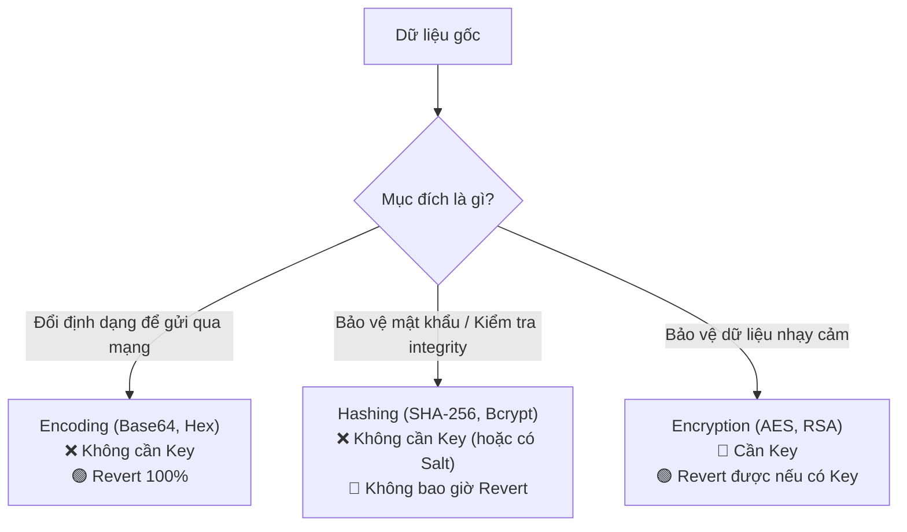

# 📘 CẨM NANG TOÀN TẬP VỀ KHOA HỌC DỮ LIỆU & MÃ HÓA BẢO MẬT (CRYPTOGRAPHY HANDBOOK)

---

## 📌 CHƯƠNG 1: ĐƠN VỊ DỮ LIỆU NỀN TẢNG (BIT, BYTE, HEX, BASE64)

### 1.1. Bit & Byte là gì?
- **Bit (Binary Digit)**: Đơn vị thông tin nhỏ nhất trong máy tính, chỉ mang 1 trong 2 giá trị: `0` (Tắt) hoặc `1` (Bật).
- **Byte**: Tập hợp của **8 Bits** liên tiếp. 
  $$\text{1 Byte} = \text{8 Bits}$$
  - 1 Byte biểu diễn được $2^8 = 256$ giá trị khác nhau (từ `0` đến `255`).

### 1.2. Các Hệ đếm & Định dạng biểu diễn Dữ liệu

| Định dạng | Cơ số (Base) | Các ký tự sử dụng | Dung lượng biểu diễn | Mục đích sử dụng |
|---|---|---|---|---|
| **Binary** | Base 2 | `0`, `1` | 8 bits / byte | Máy tính xử lý trực tiếp dưới phần cứng |
| **Hexadecimal (Hex)** | Base 16 | `0-9`, `A-F` (hoặc `a-f`) | 2 ký tự / byte | Hiển thị chuỗi Hash (SHA-256, MD5), Mã màu CSS, Địa chỉ MAC/RAM |
| **Base64** | Base 64 | `A-Z`, `a-z`, `0-9`, `+`, `/` (và `=` đệm) | 4 ký tự / 3 bytes | Truyền dữ liệu nhị phân (Ảnh, File, JWT Token) qua đường truyền Văn bản (HTTP/Email) |

---

### 1.3. Ví dụ Chuyển đổi Thực tế (Step-by-Step)

Giả sử chúng ta có ký tự chữ cái **`A`**:

```text
[Ký tự 'A'] 
    └── Mã ASCII: 65 (Hệ thập phân - Decimal)
    └── Nhị phân (Binary - Base 2): 01000001 (8 bits / 1 byte)
    └── Hex (Base 16): 0x41 (2 ký tự Hex)
    └── Base64 (Base 64): QQ==
```

#### 🔄 Quy trình chuyển đổi từ Binary sang Base64:
1. Lấy mảng nhị phân (ví dụ 3 bytes = 24 bits): `01000001 01000010 01000011` (`ABC`).
2. Chia 24 bits đó thành **4 nhóm, mỗi nhóm 6 bits**:
   - `010000` = 16 ➔ Ký tự thứ 16 trong bảng Base64 là **`Q`**
   - `010100` = 20 ➔ Ký tự thứ 20 trong bảng Base64 là **`U`**
   - `001001` = 9  ➔ Ký tự thứ 9 trong bảng Base64 là **`J`**
   - `000011` = 3  ➔ Ký tự thứ 3 trong bảng Base64 là **`D`**
3. Kết quả Base64 của chuỗi `ABC` là: **`QUJD`**.

---

## 📌 CHƯƠNG 2: PHÂN BIỆT MÃ HÓA ĐỊNH DẠNG (ENCODING) vs BĂM (HASHING) vs MÃ HÓA BẢO MẬT (ENCRYPTION)

> [!IMPORTANT]
> Rất nhiều lập trình viên nhầm lẫn giữa Base64 và Mã hóa bảo mật. Base64 **KHÔNG PHẢI LÀ MÃ HÓA BẢO MẬT** vì bất kỳ ai cũng giải mã (Decode) được mà không cần chìa khóa!



---

## 📌 CHƯƠNG 3: 3 HỌ CƠ CHẾ BẢO MẬT & MÃ HÓA KINH ĐIỂN

### 3.1. HỌ 1: Hashing (Băm 1 chiều - Non-reversible)
- **Tính chất**: Mã hóa 1 chiều. Không thể quy đổi (Revert) từ chuỗi Hash ngược lại dữ liệu gốc.
- **Thuật toán phổ biến**:

| Thuật toán | Độ dài đầu ra | Tốc độ | Độ an toàn | Trường hợp sử dụng tiêu biểu |
|---|---|---|---|---|
| **MD5 / SHA-1** | 128 / 160 bits | Siêu nhanh | 🔴 Đã bị bẻ khóa | **Không dùng nữa** cho bảo mật |
| **SHA-256** | 256 bits (32 bytes) | Siêu nhanh | 🟢 An toàn | Bitcoin Blockchain, Git commit ID, Kiểm tra File toàn vẹn |
| **SHA-512** | 512 bits (64 bytes) | Siêu nhanh | 🟢 Rất an toàn | Chữ ký số, Kiểm tra dữ liệu lớn |
| **HMAC-SHA512** | 512 bits + Key | Rất nhanh | 🟢 Rất an toàn | **JWT Access Token**, API Request Authentication |
| **Bcrypt / Argon2** | Cấu hình linh hoạt | 🐢 Cố tình Rùa bò | 🏆 An toàn tuyệt đối | **Mật khẩu tài khoản người dùng** (Chống trâu cày GPU) |

---

### 3.2. HỌ 2: Symmetric Encryption (Mã hóa Đối xứng - Reversible với 1 Key)
- **Tính chất**: Mã hóa 2 chiều. Dùng **ĐÚNG 1 CHÌA KHÓA BÍ MẬT (Shared Secret Key)** để vừa Khóa (Encrypt) vừa Mở (Decrypt/Revert).
- **Thuật toán tiêu biểu**: **AES-256 (Advanced Encryption Standard)**, ChaCha20.
- **Cách hoạt động**:
  ```text
  [Văn bản thô] + [Chìa khóa K] ➔ [Mã hóa AES] ➔ [Chuỗi dữ liệu bị khóa]
  [Chuỗi dữ liệu bị khóa] + [Chìa khóa K] ➔ [Giải mã AES] ➔ [Văn bản thô ban đầu]
  ```
- **Ứng dụng**: 
  - Mã hóa số Thẻ tín dụng, Căn cước công dân trong Database.
  - Mã hóa toàn bộ ổ cứng máy tính (Windows BitLocker, macOS FileVault).

---

### 3.3. HỌ 3: Asymmetric Encryption & Digital Signature (Bất đối xứng & Chữ ký số)
- **Tính chất**: Mã hóa 2 chiều dùng **1 CẶP CHÌA KHÓA ĐI CÙNG NHAU**:
  - **Public Key (Công khai)**: Phát cho cả thế giới.
  - **Private Key (Bí mật)**: Chỉ 1 người giữ kín tuyệt đối.

- **2 Quy tắc toán học kinh điển**:
  1. **Bảo mật dữ liệu**: Cái gì được khóa bằng **Public Key** ➔ Chỉ có **Private Key** tương ứng mới mở được.
  2. **Chữ ký số (Digital Signature)**: Cái gì được đóng dấu bằng **Private Key** ➔ Cả thế giới dùng **Public Key** đều kiểm tra được tính chính chủ!

- **Thuật toán tiêu biểu**: **RSA** (RSA-2048/4096), **ECC / ECDSA** (Elliptic Curve Cryptography).
- **Ứng dụng**:
  - **HTTPS / SSL** (Khóa bảo mật của trình duyệt web).
  - **SSH Key** (Giao tiếp bảo mật giữa máy tính với GitHub/Server).
  - **Hóa đơn điện tử & Chữ ký số doanh nghiệp**.

---

## 📌 CHƯƠNG 4: BẢNG TRA CỨU QUYẾT ĐỊNH (DECISION CHEATSHEET)

### "Khi nào nên dùng Cơ chế nào?"

| Bài toán thực tế | Cơ chế khuyên dùng | Thuật toán chuẩn mực | Lý do lựa chọn |
|---|---|---|---|
| **Lưu mật khẩu người dùng** | Hashing (Cố tình rùa bò + Dynamic Salt) | **Argon2id** hoặc **Bcrypt** hoặc **PBKDF2** | Ngăn chặn trâu cày GPU dò mật khẩu & triệt hạ Rainbow Table |
| **Tạo Token đăng nhập (JWT)** | HMAC Hashing | **HMAC-SHA512** (với Key 64-bytes) | Giúp Server xác thực nhanh token có bị giả mạo không |
| **Lưu số Thẻ tín dụng / CCCD vào DB** | Symmetric Encryption | **AES-256-GCM** | Cần giải mã (Revert) ra số thẻ gốc khi thanh toán |
| **Gửi file ảnh qua API HTTP** | Data Encoding | **Base64** | Chuyển dữ liệu nhị phân thành chuỗi văn bản an toàn |
| **Đánh dấu phiên bản code Git** | Hashing | **SHA-1 / SHA-256** | Đảm bảo tính duy nhất và toàn vẹn của code |
| **Kết nối HTTPS Web & Push GitHub** | Asymmetric Encryption | **RSA-4096** hoặc **Ed25519 (ECC)** | Xác thực danh tính giữa 2 bên mà không cần gửi chìa khóa bí mật qua mạng |

---

> [!TIP]
> **Tóm tắt nhanh cho Lập trình viên:**
> 1. Cần giấu mật khẩu mãi mãi? ➔ **Hash (Bcrypt / PBKDF2)**.
> 2. Cần khóa dữ liệu rồi sau này mở ra xem lại? ➔ **Mã hóa đối xứng (AES-256)**.
> 3. Cần xác thực danh tính / Chữ ký số / Kết nối mạng? ➔ **Bất đối xứng (Public/Private Key)**.
> 4. Cần đóng gói file/ảnh để gửi qua API Text? ➔ **Base64**.
